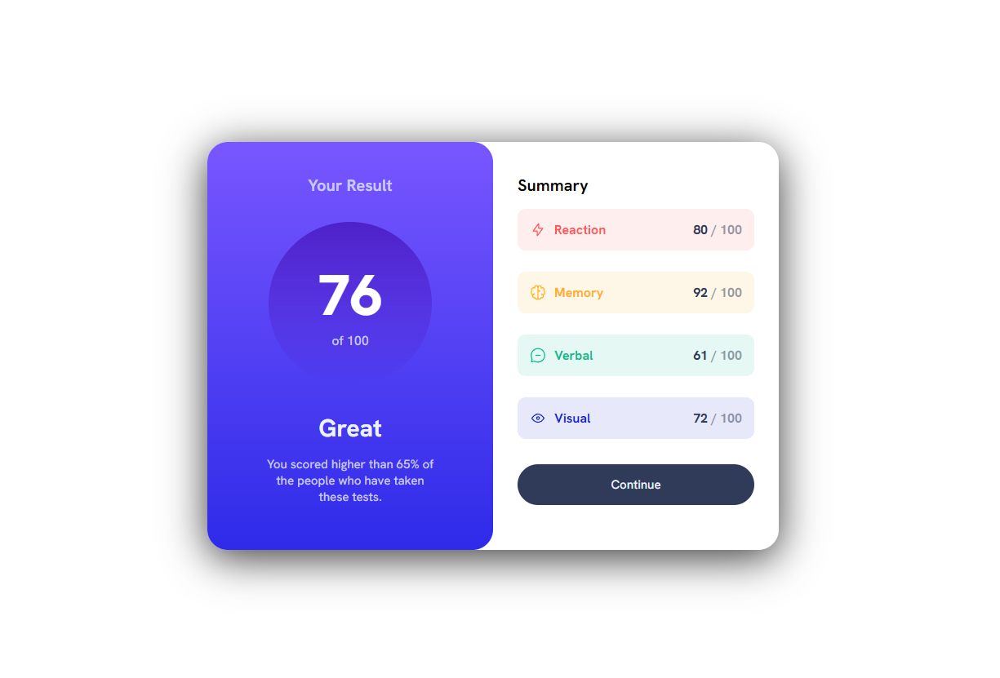

# Frontend Mentor - Results summary component
Hi! I'm starting my adventure with front-end mentor and I did this challenge to warm up 🥵
## Screenshots
### Desktop version:

### Mobile version:

## What did I use to create the project? 🤔🤔
 - **HTML5**
 - **CSS**
 - **BEM Methodology**
## What I learned? 🤔🤔
As I mentioned it was a warm-up so I didn't have to study much. The thing i learned is to use front-end Mentor which i will use more often 🤠